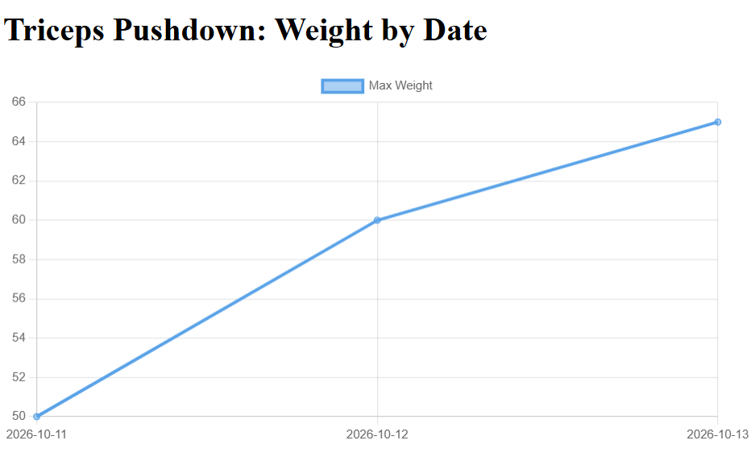

# Workout Tracker (Web)

A multi-user Flask web app for logging workouts, tracking your best lifts, and charting strength progress over time. It's the web version of my [command-line workout tracker](https://github.com/landonalexander16/workout-tracker).

**Live demo:** (https://workout-tracker-web-bk9e.onrender.com/)

> The app runs on free hosting, so the first load after a quiet period can take up to a minute while the server and database wake up.



## Features

- Accounts with registration, login, and logout; passwords are stored only as hashes
- Log sets by date, exercise, weight, and reps; new sets merge into the existing workout for that date and the existing exercise with the same name (case-insensitive)
- Edit a set, or delete a set, an exercise, or a whole workout; empty exercises and workouts are cleaned up automatically
- Each user sees only their own data, and every edit or delete checks ownership (other users' ids return "Not Found")
- Stats page showing the heaviest set (weight and reps) for each exercise
- Progress chart per exercise showing max weight by date
- Server-side validation of dates, weights, and reps, with errors shown on the form

## Tech Stack

Python, Flask, Flask-Login, Flask-SQLAlchemy, Jinja2, Chart.js. SQLite for local development; PostgreSQL (Neon) in production, hosted on Render.

## Run Locally

1. Clone the repo and enter it:
```
   git clone https://github.com/landonalexander16/workout-tracker-web.git
   cd workout-tracker-web
```
2. Create and activate a virtual environment:
```
   python -m venv venv
   venv\Scripts\activate        # Windows (PowerShell)
   source venv/bin/activate     # Mac/Linux
```
3. Install dependencies and run:
```
   pip install -r requirements.txt
   python app.py
```
4. Open http://127.0.0.1:5000

With no configuration, the app uses a local SQLite file (`instance/workout.db`). These environment variables are optional:

| Variable | Purpose |
|---|---|
| `DATABASE_URL` | Postgres connection string (production) |
| `SECRET_KEY` | Signs login sessions; required in production |
| `COOKIE_SECURE` | Set to `1` to send the session cookie over HTTPS only |

## Data Model

`User` → `Workout` (one per user per date) → `WorkoutExercise` → `WorkoutSet`. Each child stores its parent's id, and deleting a parent cascades to its children.

## Project Structure

- `app.py`: routes, analytics functions, and helpers
- `db_models.py`: SQLAlchemy models
- `templates/`: Jinja templates, all extending `base.html`

## Known Limitations

- No password reset
- No CSRF tokens on forms yet (session cookies use `SameSite=Lax`)
- Exercise names and workout dates can't be edited; delete and re-enter instead

## Planned

- CSRF protection
- Exercise name autocomplete, so variants like "bench" and "bench press" don't split stats
- Rename exercises and change workout dates
- Login rate limiting
